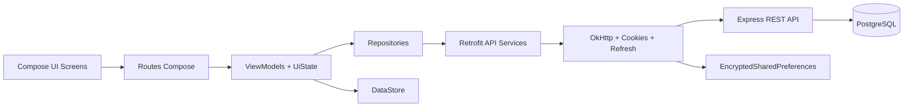

# Architecture du projet

## 1. Vue d'ensemble

Ce projet est organisé en deux applications distinctes mais fortement couplées :

- `mobile-kotlin` : application Android native en Kotlin avec Jetpack Compose.
- `backend` : API REST en Node.js/TypeScript avec Express et PostgreSQL.

Le mobile implémente une architecture majoritairement **MVVM**, enrichie par :

- un **Repository pattern** par domaine fonctionnel ;
- une séparation **DTO -> mapper -> modèle d'application** ;
- une **navigation Compose multi-backstack** ;
- une **gestion de session par cookies HTTP** persistés localement ;
- une **injection de dépendances manuelle** via un conteneur applicatif.

L'ensemble forme une architecture en couches simple et lisible :



## 2. Stack technique

### Frontend Android

- Kotlin
- Jetpack Compose
- `androidx.lifecycle` pour les `ViewModel` et `StateFlow`
- `androidx.navigation3` pour la navigation
- Retrofit + OkHttp pour les appels réseau
- Kotlinx Serialization pour les DTO JSON
- DataStore pour les préférences d'authentification non sensibles
- EncryptedSharedPreferences pour les cookies persistés

### Backend

- Node.js
- TypeScript
- Express
- PostgreSQL avec requêtes SQL directes via `pg`
- JWT en cookies HTTP (`access_token`, `refresh_token`)
- Multer pour les uploads (`avatar`, images de jeux)
- Nodemailer pour les emails de vérification et de reset password

## 3. Design patterns et principes utilisés

### MVVM côté mobile

Le pattern principal côté mobile est **MVVM** :

- les `Screen` Compose restent surtout déclaratifs ;
- les `ViewModel` portent l'état, la validation, les appels réseau et les transitions ;
- chaque feature expose des `UiState` dédiés.

Le projet applique une variante fréquente en Compose :

- `Route` : crée le `ViewModel`, collecte le `uiState`, transforme les callbacks ;
- `Screen` : ne rend que l'interface avec état + actions.

Cela évite de mélanger navigation, logique métier et rendu Compose.

### Repository pattern

Chaque domaine possède :

- une interface de repository ;
- une implémentation ;
- un ou plusieurs services Retrofit ;
- des DTO réseau ;
- des mappers ;
- des modèles utilisés par l'UI.

Exemples :

- `AuthRepository` / `AuthRepositoryImpl`
- `GamesRepository` / `GamesRepositoryImpl`
- `ReservantsRepository` / `ReservantsRepositoryImpl`
- `ProfileRepository` / `ProfileRepositoryImpl`

### Mapping explicite DTO -> modèles

Le backend ne renvoie pas directement des objets consommés bruts par l'UI.
Le mobile passe systématiquement par :

1. des DTO réseau dans `data/remote/*`
2. des mappers dans `data/mapper/*`
3. des modèles utilisés par l'application dans `data/entity/*`

Important :

- il n'existe pas de couche `domain/` séparée ;
- les modèles “métier” consommés par les `ViewModel` résident dans `data/entity`.

### Gestion d'état

Le projet combine plusieurs niveaux de state management :

- `MutableStateFlow` / `StateFlow` dans les `ViewModel`
- `UiState` dédiés par écran
- reducers pour les écrans de catalogue (`games`, `reservants`)
- `rememberSaveable` pour certains états d'application et de navigation

Cette approche donne :

- une bonne prédictibilité ;
- des états immutables par copie ;
- une gestion propre des bannières, erreurs, suppression, pagination et refresh.

### Injection de dépendances manuelle

Il n'y a pas de framework DI comme Hilt ou Koin.
Les dépendances sont construites manuellement dans `AppContainer` :

- `AuthPreferenceStore`
- `PersistentCookieJar`
- `AuthRefreshInterceptor`
- `OkHttpClient`
- `Retrofit`
- `ApiService`
- `Repository`

Cette approche est simple mais centralise toute la composition dans un seul point.

### Navigation multi-backstack

Le shell Compose (`FestivalApp`) maintient :

- un onglet top-level par contexte principal ;
- un `NavBackStack` par onglet ;
- une politique d'affichage (`top bar`, `back`, `bottom bar`) selon l'écran actif.

Les destinations sont des clés sérialisables (`AppNavKey`), ce qui rend la navigation fortement typée.

### Session web côté mobile

Le mobile n'utilise pas de token bearer dans un header.
La session repose sur des **cookies HTTP** :

- `access_token`
- `refresh_token`

Le cycle est le suivant :

1. login via `/api/auth/login`
2. réception des cookies
3. persistance locale chiffrée du cookie store
4. restauration de session via `/api/auth/whoami`
5. refresh automatique via `/api/auth/refresh` sur `401/403`

## 4. Organisation des répertoires

### Racine

```text
.
├── backend/                 # API Express + PostgreSQL
├── mobile-kotlin/           # Application Android Kotlin
├── docker-compose.dev.yml   # Base PostgreSQL locale
├── BACKEND_FRONTEND_SETUP.md
└── architecture.md
```

### Mobile Android

```text
mobile-kotlin/app/src/main/java/com/projetmobile/mobile
├── AppContainer.kt
├── MainActivity.kt
├── data
│   ├── database            # DataStore + cookie store chiffré
│   ├── entity              # Modèles utilisés par l'application
│   ├── mapper              # DTO -> modèles
│   ├── remote              # Retrofit services + DTOs
│   └── repository          # Repositories par domaine
├── ui
│   ├── components          # Composants UI réutilisables
│   ├── screens             # Features et écrans
│   │   ├── app             # Shell applicatif, navigation, scaffold
│   │   ├── auth
│   │   ├── festival
│   │   ├── games
│   │   ├── profile
│   │   └── reservants
│   ├── theme
│   └── utils               # session, validation, navigation
└── workers                 # placeholder pour traitements asynchrones
```

Notes :

- `data/dao` et `workers` sont présents mais non exploités à ce stade ;
- `games` et `reservants` sont les features les plus structurées, avec sous-dossiers `catalog`, `detail`, `form`.

### Backend

```text
backend/src
├── config                  # variables d'environnement, cookies
├── db                      # connexion PostgreSQL, migrations, seeds
├── middleware              # auth, rôles, JWT
├── routes                  # endpoints REST par domaine
├── services                # email
├── tests                   # tests backend
└── types                   # types Express/JWT
```

Les routes importantes pour le mobile sont :

- `auth.ts`
- `users.ts`
- `games.ts`
- `reservant.ts`
- `editor.ts`
- `mechanisms.ts`
- `upload.ts`

## 5. Fichiers pivots

| Fichier | Rôle |
|---|---|
| `mobile-kotlin/.../AppContainer.kt` | Composition manuelle des dépendances mobile |
| `mobile-kotlin/.../MainActivity.kt` | Bootstrap Android + émission des deep links |
| `mobile-kotlin/.../ui/screens/app/FestivalApp.kt` | Shell principal, session, onglets, backstacks |
| `mobile-kotlin/.../ui/screens/app/FestivalAppEntryProvider.kt` | Raccord navigation -> routes/features |
| `mobile-kotlin/.../ui/utils/session/AppSessionViewModel.kt` | État global de session côté mobile |
| `mobile-kotlin/.../data/database/PersistentCookieJar.kt` | Persistance sécurisée des cookies |
| `mobile-kotlin/.../data/remote/auth/AuthRefreshInterceptor.kt` | Refresh automatique de session |
| `backend/src/server.ts` | Montage des middlewares, routes et sécurité globale |
| `backend/src/routes/auth.ts` | Auth, vérification email, reset password, refresh, whoami |
| `backend/src/routes/users.ts` | Profil utilisateur connecté |

## 6. Flux global mobile -> backend

Le chemin standard d'une action utilisateur est :

1. interaction dans un `Screen` Compose ;
2. appel d'un callback transmis par la `Route` ;
3. exécution dans le `ViewModel` ;
4. validation éventuelle ;
5. appel au `Repository` ;
6. appel HTTP via Retrofit ;
7. réponse backend ;
8. mapping DTO -> modèle ;
9. mise à jour du `UiState`.

Exemple générique :

```text
Screen -> Route -> ViewModel -> Repository -> ApiService -> Express Route -> PostgreSQL
```

Les erreurs suivent aussi un pipeline standardisé :

- backend : JSON d'erreur cohérent ;
- mobile data layer : `runRepositoryCall` + `RepositoryException` ;
- UI layer : mappers d'erreurs vers bannière ou erreur de champ.

## 7. Architecture fonctionnelle des features

### 7.1 Auth

### Ce que couvre la feature

La feature auth regroupe :

- connexion
- inscription
- attente de vérification email
- résultat de vérification email
- mot de passe oublié
- réinitialisation du mot de passe

### Organisation frontend

Les écrans sont dans :

- `ui/screens/auth/login`
- `ui/screens/auth/register`
- `ui/screens/auth/emailverification`
- `ui/screens/auth/forgotpassword`
- `ui/screens/auth/resetpassword`

Chaque écran suit le même schéma :

- `UiState`
- `ViewModel`
- `Screen`

La validation est centralisée dans `ui/utils/validation/AuthFormValidator.kt`.

### Flux frontend

- `LoginViewModel` valide les champs puis appelle `AuthRepository.login`
- `RegisterViewModel` crée un compte puis pousse vers `PendingVerification`
- `PendingVerificationViewModel` peut renvoyer un email de vérification
- `ForgotPasswordViewModel` déclenche l'envoi d'un lien
- `ResetPasswordViewModel` consomme le token issu d'un deep link

### Lien avec le backend

Le mobile consomme :

- `POST /api/auth/login`
- `POST /api/auth/register`
- `POST /api/auth/resend-verification`
- `POST /api/auth/password/forgot`
- `POST /api/auth/password/reset`
- `POST /api/auth/logout`
- `GET /api/auth/whoami`

Le backend gère :

- création des cookies de session ;
- création et rotation des refresh tokens ;
- vérification email par lien ;
- génération de deep links mobiles ;
- invalidation des refresh tokens au logout et lors d'un reset password.

### Deep links

Deux deep links Android sont définis :

- `festivalapp://auth/verification`
- `festivalapp://auth/reset-password`

Ils permettent au backend de rediriger l'utilisateur depuis un email vers l'application mobile.

### 7.2 Profil

### Ce que couvre la feature

La feature profil permet :

- de consulter le profil connecté ;
- d'éditer les champs principaux ;
- de déclencher un reset password ;
- de se déconnecter ;
- de préparer l'upload d'avatar.

### Organisation frontend

La feature vit dans `ui/screens/profile`.

Le `ProfileViewModel` :

- charge le profil au démarrage ;
- gère le champ en cours d'édition ;
- calcule un diff avant envoi ;
- transforme les erreurs backend en erreurs de formulaire ou messages ;
- notifie la session globale quand les données utilisateur changent.

Le `ProfileUiState` est riche :

- `profile`
- `form`
- `editingFields`
- messages d'information / d'erreur
- état avatar
- `pendingSessionUserUpdate`

### Lien avec le backend

Le mobile consomme :

- `GET /api/users/me`
- `PUT /api/users/me`
- `POST /api/upload/avatar`
- `POST /api/auth/password/forgot` depuis le profil pour le reset password

### Points notables

- le backend supporte déjà `avatarUrl` dans `PUT /users/me` ;
- l'upload avatar existe côté repository et ViewModel ;
- l'UI Android n'expose pas encore complètement ce pipeline avatar.

### 7.3 Jeux

### Ce que couvre la feature

La feature `games` est la plus complète côté front :

- catalogue paginé ;
- filtres ;
- tri ;
- détail ;
- création ;
- édition ;
- suppression ;
- upload d'image ;
- création liée à un réservant/éditeur.

### Organisation frontend

Structure :

- `ui/screens/games/catalog`
- `ui/screens/games/detail`
- `ui/screens/games/form`
- `ui/screens/games/shared`

Le catalogue utilise un pattern plus avancé :

- `GamesCatalogViewModel`
- `GamesCatalogUiState`
- `GamesCatalogStateReducer`
- `GamesCatalogLookupsLoader`

Cela permet de gérer proprement :

- la pagination ;
- les refresh ;
- les suppressions ;
- les lookups ;
- les filtres ;
- les colonnes visibles.

Le détail est plus simple :

- un `ViewModel` de chargement par ID ;
- un écran de rendu ;
- une possibilité d'éditer selon le rôle.

Le formulaire gère :

- création et édition ;
- pré-remplissage en mode edit ;
- chargement des types/éditeurs/mécanismes ;
- validation locale ;
- upload image puis sauvegarde ;
- verrouillage éventuel de l'éditeur quand on crée depuis un réservant.

### Lien avec le backend

Le mobile consomme :

- `GET /api/games`
- `GET /api/games/types`
- `GET /api/games/:id`
- `POST /api/games`
- `PUT /api/games/:id`
- `DELETE /api/games/:id`
- `GET /api/editors`
- `GET /api/mechanisms`
- `POST /api/upload/game-image`

### Règles d'accès

- lecture des jeux : utilisateur authentifié ;
- création / édition / suppression / upload image : rôles backoffice (`admin`, `super-organizer`, `organizer`).

### Particularité d'architecture

Contrairement à `reservants`, la feature `games` délègue le filtrage et la pagination au backend.
Le catalogue n'est donc pas un simple filtre local : il pilote réellement les paramètres serveur.

### 7.4 Réservants

### Ce que couvre la feature

La feature `reservants` couvre :

- catalogue ;
- détail ;
- création ;
- édition ;
- suppression ;
- contacts associés ;
- affichage des jeux liés à l'éditeur associé ;
- passerelle vers la création d'un jeu lié.

### Organisation frontend

Structure :

- `ui/screens/reservants/catalog`
- `ui/screens/reservants/detail`
- `ui/screens/reservants/form`
- `ui/screens/reservants/shared`

Le catalogue s'appuie sur :

- `ReservantsCatalogViewModel`
- `ReservantsCatalogUiState`
- `ReservantsCatalogStateReducer`

Ici, le fonctionnement diffère de `games` :

- la liste complète est chargée ;
- les filtres et tris sont ensuite faits localement côté mobile.

Le détail est organisé en onglets :

- `Infos`
- `Contacts`
- `Jeux`

Le `ReservantDetailViewModel` :

- charge le réservant ;
- charge les contacts ;
- charge les jeux liés via l'éditeur ;
- gère l'ajout d'un contact inline.

Le formulaire :

- charge les éditeurs disponibles ;
- affiche le sélecteur d'éditeur seulement si `type == editeur` ;
- gère création et édition dans le même ViewModel.

### Lien avec le backend

Le mobile consomme :

- `GET /api/reservant`
- `GET /api/reservant/:id`
- `POST /api/reservant`
- `PUT /api/reservant/:id`
- `DELETE /api/reservant/:id`
- `GET /api/reservant/:id/delete-summary`
- `GET /api/reservant/:id/contacts`
- `POST /api/reservant/:id/contacts`
- `GET /api/editors`
- indirectement `GET /api/games?editor_id=...` pour l'onglet jeux liés

### Règles d'accès

Toute la feature est montée côté serveur derrière :

- `verifyToken`
- `requireRole(['admin', 'super-organizer', 'organizer'])`

La suppression est encore plus restrictive :

- `admin`
- `super-organizer`

### Particularité d'architecture

Cette feature illustre bien la coopération entre domaines :

- `reservants` charge ses propres données ;
- l'onglet `Jeux` réutilise `GamesRepository` ;
- la création d'un jeu lié ouvre directement le formulaire `games` avec éditeur prérempli.

## 8. Comment le frontend est relié au backend

### Base URL

Le mobile obtient l'URL de l'API via `BuildConfig.API_BASE_URL`.

En debug, la valeur par défaut cible :

- `http://10.0.2.2:4000/api/`

Cela permet à l'émulateur Android d'atteindre le backend local.

Les montages backend réellement utiles au mobile sont :

- `/api/auth`
- `/api/users`
- `/api/reservant`
- `/api/games`
- `/api/editors`
- `/api/mechanisms`
- `/api/upload`

### Contrats réseau

Chaque domaine possède son contrat Retrofit :

- `AuthApiService`
- `ProfileApiService`
- `GamesApiService`
- `ReservantsApiService`
- `FestivalApiService`

Les repositories consomment ensuite ces services, jamais les `ViewModel` directement.

### Authentification et session

Le backend monte les routes comme suit :

- `/api/auth/*` : public pour login/register/verify/reset ;
- `/api/users/*` : protégé par `verifyToken` ;
- `/api/games/*` : protégé par `verifyToken`, avec restrictions supplémentaires pour write ;
- `/api/reservant/*` : protégé par `verifyToken` + `requireRole(...)`.

Le mobile n'a donc pas à injecter manuellement les autorisations par header.
Les cookies de session suffisent.

### Uploads

Les uploads sont gérés séparément :

- `/api/upload/avatar`
- `/api/upload/game-image`

Le mobile envoie un `MultipartBody.Part`, récupère une URL locale backend (`/uploads/...`) puis réinjecte cette URL dans la donnée métier.

### Matrice de liaison frontend / backend

#### Auth

| Endpoint backend | Utilisation mobile | Consommé par |
|---|---|---|
| `POST /api/auth/login` | Connexion | `AuthApiService` -> `AuthRepository` -> `LoginViewModel` |
| `POST /api/auth/register` | Inscription | `AuthApiService` -> `AuthRepository` -> `RegisterViewModel` |
| `POST /api/auth/resend-verification` | Renvoyer email de vérification | `PendingVerificationViewModel`, `LoginViewModel` |
| `POST /api/auth/password/forgot` | Demande de reset password | `ForgotPasswordViewModel`, `ProfileViewModel` via `ProfileRepository` |
| `POST /api/auth/password/reset` | Validation d’un nouveau mot de passe | `ResetPasswordViewModel` |
| `POST /api/auth/logout` | Déconnexion | `AppSessionViewModel` |
| `GET /api/auth/whoami` | Restauration de session | `AuthRepository.restoreSession()` |
| `POST /api/auth/refresh` | Renouvellement implicite de session | `AuthRefreshInterceptor` |

Routes présentes côté backend mais non appelées par Retrofit :

- `GET /api/auth/verify-email`
- `GET /api/auth/reset-password`

Ces routes servent de passerelle entre email/browser et deep links Android.

#### Profil

| Endpoint backend | Utilisation mobile | Consommé par |
|---|---|---|
| `GET /api/users/me` | Charger le profil courant | `ProfileRepository.getProfile()` |
| `PUT /api/users/me` | Mettre à jour login, nom, email, téléphone, avatarUrl | `ProfileRepository.updateProfile()` |
| `POST /api/upload/avatar` | Upload de l’avatar | `ProfileRepository.uploadAvatar()` |
| `POST /api/auth/password/forgot` | Lien de reset depuis l’écran profil | `ProfileRepository.requestPasswordReset()` |

Routes backend non exploitées par le mobile actuel :

- `DELETE /api/users/me`
- le CRUD admin de `/api/users/*`

#### Jeux

| Endpoint backend | Utilisation mobile | Consommé par |
|---|---|---|
| `GET /api/games` | Catalogue paginé, filtres, tri, jeux liés à un éditeur | `GamesRepository.getGames()` |
| `GET /api/games/types` | Lookup types de jeux | `GamesCatalogLookupsLoader`, `GameFormLookupsLoader` |
| `GET /api/games/:id` | Détail d’un jeu | `GamesRepository.getGame()` |
| `POST /api/games` | Création | `GameFormViewModel` |
| `PUT /api/games/:id` | Mise à jour | `GameFormViewModel` |
| `DELETE /api/games/:id` | Suppression | `GamesCatalogViewModel` |
| `GET /api/editors` | Lookup éditeurs | `games` et `reservants` |
| `GET /api/mechanisms` | Lookup mécanismes | `games` |
| `POST /api/upload/game-image` | Upload d’image | `GameFormViewModel` |

Routes présentes mais non utilisées par Android :

- `GET /api/games/:id/mechanisms`
- `PATCH /api/games/:id`

#### Réservants

| Endpoint backend | Utilisation mobile | Consommé par |
|---|---|---|
| `GET /api/reservant` | Charger le catalogue | `ReservantsRepository.getReservants()` |
| `GET /api/reservant/:id` | Charger le détail | `ReservantsRepository.getReservant()` |
| `POST /api/reservant` | Création | `ReservantFormViewModel` |
| `PUT /api/reservant/:id` | Mise à jour | `ReservantFormViewModel` |
| `DELETE /api/reservant/:id` | Suppression | `ReservantsCatalogViewModel` |
| `GET /api/reservant/:id/delete-summary` | Prévisualiser les impacts de suppression | `ReservantsCatalogViewModel` |
| `GET /api/reservant/:id/contacts` | Charger les contacts | `ReservantDetailViewModel` |
| `POST /api/reservant/:id/contacts` | Ajouter un contact | `ReservantDetailViewModel` |
| `GET /api/editors` | Lookup éditeurs liés | `ReservantFormViewModel` |
| `GET /api/games?editor_id=...` | Jeux liés au réservant par éditeur | `ReservantDetailViewModel` via `GamesRepository` |

Routes backend présentes mais non utilisées par Android :

- `PATCH /api/reservant/:id/workflow`
- `PATCH /api/reservant/:id/workflow/flags`
- les routes timeline et événements de contact
- les suppressions fines de contacts/événements

### Contrôle d'accès backend

La liaison mobile/backend dépend aussi des garde-fous côté Express :

- `/api/users/me` : tout utilisateur authentifié
- `/api/games` lecture : toute session authentifiée
- `/api/games` écriture : `admin`, `super-organizer`, `organizer`
- `/api/reservant/*` : backoffice uniquement dès le montage
- suppression de réservant : plus restrictive (`admin`, `super-organizer`)

## 9. Points forts et limites actuelles

### Points forts

- architecture lisible et cohérente ;
- séparation nette UI / état / data ;
- gestion de session robuste pour une app mobile ;
- navigation typée ;
- features `games` et `reservants` bien structurées ;
- backend explicite, sans magie d'ORM.

### Limites ou compromis

- pas de vraie couche `domain` séparée ;
- DI manuelle qui peut grossir avec le projet ;
- certaines features sont plus “riches” que d'autres, donc le niveau de sophistication n'est pas homogène ;
- pipeline avatar présent techniquement mais pas encore totalement branché à l'UI ;
- `data/dao` et `workers` sont encore des emplacements réservés.

## 10. Résumé

En pratique, l'architecture du projet repose sur :

- **Android Compose + MVVM** côté client ;
- **repositories + services Retrofit + mappers** comme couche d'accès aux données ;
- **navigation3 multi-backstack** pour l'expérience applicative ;
- **session cookie-based persistée localement** pour l'auth ;
- **Express + PostgreSQL** côté backend avec contrôle d'accès par rôles.

Les features `auth`, `profil`, `jeux` et `réservants` suivent toutes la même colonne vertébrale :

```text
Screen -> Route -> ViewModel -> Repository -> ApiService -> Route Express -> PostgreSQL
```

La variation principale entre features ne se trouve pas dans l'architecture générale, mais dans le niveau de sophistication de leur gestion d'état :

- `auth` et `profil` : flux orientés formulaire/session ;
- `games` : feature la plus avancée, avec pagination serveur et reducers ;
- `réservants` : feature transverse orientée gestion métier et liens avec les jeux.
